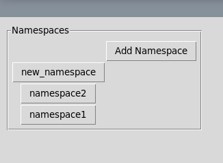
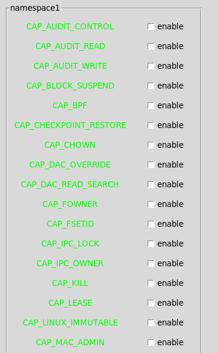
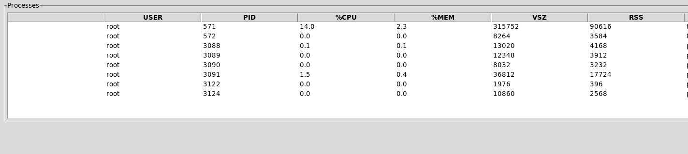

# NamespaceGUI
<!-- Improved compatibility of back to top link: See: https://github.com/othneildrew/Best-README-Template/pull/73 -->
<a name="readme-top"></a>
<!--
*** Thanks for checking out the Best-README-Template. If you have a suggestion
*** that would make this better, please fork the repo and create a pull request
*** or simply open an issue with the tag "enhancement".
*** Don't forget to give the project a star!
*** Thanks again! Now go create something AMAZING! :D
-->


<!-- PROJECT SHIELDS -->
<!--
*** I'm using markdown "reference style" links for readability.
*** Reference links are enclosed in brackets [ ] instead of parentheses ( ).
*** See the bottom of this document for the declaration of the reference variables
*** for contributors-url, forks-url, etc. This is an optional, concise syntax you may use.
*** https://www.markdownguide.org/basic-syntax/#reference-style-links
-->
[![Contributors][contributors-shield]][contributors-url]
[![Forks][forks-shield]][forks-url]
[![Stargazers][stars-shield]][stars-url]
[![Issues][issues-shield]][issues-url]
[![MIT License][license-shield]][license-url]
[![LinkedIn][linkedin-shield]][linkedin-url]


<!-- PROJECT LOGO -->
<br />
<div align="center">
  <a href="https://github.com/edentibebu/NamespaceGUI">
    
  </a>

<h3 align="center">Namespace GUI</h3>

  <p align="center">
    Our project is an enhancement to the Linux userspace that is a graphical user interface for namespaces. This is a significant modification which would improve the user experience in creating namespaces and editing namespaces, as the current interface is through command line only. 
    <br />
    <a href="https://github.com/edentibebu/NamespaceGUI"><strong>Explore the docs »</strong></a>
    <br />
    <br />
    <a href="https://github.com/edentibebu/NamespaceGUI">View Demo</a>
  </p>
</div>


<!-- TABLE OF CONTENTS -->
<details>
  <summary>Table of Contents</summary>
  <ol>
    <li>
      <a href="#about-the-project">About The Project</a>
      <ul>
        <li><a href="#built-with">Built With</a></li>
      </ul>
    </li>
    <li>
      <a href="#getting-started">Getting Started</a>
      <ul>
        <li><a href="#prerequisites">Prerequisites</a></li>
        <li><a href="#installation">Installation</a></li>
      </ul>
    </li>
    <li><a href="#usage">Usage</a></li>
    <li><a href="#roadmap">Roadmap</a></li>
    <li><a href="#contributing">Contributing</a></li>
    <li><a href="#license">License</a></li>
    <li><a href="#contact">Contact</a></li>
    <li><a href="#acknowledgments">Acknowledgments</a></li>
  </ol>
</details>


<!-- ABOUT THE PROJECT -->
## About The Project

[![Product Name Screen Shot][product-screenshot]](https://example.com)
We've created a GUI for namespaces. Our project is an enhancement to the Linux userspace that is a graphical user interface for namespaces. This is a significant modification which would improve the user experience in creating namespaces and editing namespaces, as the current interface is through command line only. 

Functionality Features:
New namespace creation with an interface that will cover most-used command-line arguments
Displaying current namespaces and their associated privileges
Editing existing namespaces (user-id, group-id mappings)
Add processes to existing namespaces
Removing namespaces

Security Features: 
Check if privileges are being edited via command line while GUI is open 
The GUI can only be accessed by users with root/sudo access.


<p align="right">(<a href="#readme-top">back to top</a>)</p>


### Built With

* [![Python][Python.org]][Python-url]

<p align="right">(<a href="#readme-top">back to top</a>)</p>


<!-- GETTING STARTED -->
## Getting Started

This is an example of how you may give instructions on setting up your project locally.
To get a local copy up and running follow these simple example steps.

### Prerequisites

This is an example of how to list things you need to use the software and how to install them.
* npm
  ```sh
  npm install npm@latest -g
  ```

### Installation
1. Make sure you have the latest installment of python on your system. You can do this by going to this <a href="https://www.python.org/downloads/">website</a>

2. Clone the repo
   ```sh
   git clone https://github.com/edentibebu/NamespaceGUI.git
   ```
3. Navigate to the NamespaceGUI directory
   ```sh
   cd NamespaceGUI
   ```
4. Launch the python program home.py
   ```sh
   python home.py
   ```

<p align="right">(<a href="#readme-top">back to top</a>)</p>


<!-- USAGE EXAMPLES -->
## Usage
The image below is of the home page. It displays all the current namespaces. To see more details for a specific namespace, click on the name. 

* 
<br>
Clicking on a namespace takes you to the namespace page view. This displays all the capabilities and their status (whether they are enabled/disabled), which can be toggled using the checkboxes.
* 
<br>
Also on the namespace page view are the current running processes for that specific namespace. Information like the user, pids, cpu and memory usage, etc. are shown in a table.
* 


<p align="right">(<a href="#readme-top">back to top</a>)</p>


<!-- ROADMAP -->
## Roadmap

- [ ] Feature 1
- [ ] Feature 2
- [ ] Feature 3
    - [ ] Nested Feature

See the [open issues](https://github.com/edentibebu/NamespaceGUI/issues) for a full list of proposed features (and known issues).

<p align="right">(<a href="#readme-top">back to top</a>)</p>


<!-- CONTRIBUTING -->
## Contributing

Contributions are what make the open source community such an amazing place to learn, inspire, and create. Any contributions you make are **greatly appreciated**.

If you have a suggestion that would make this better, please fork the repo and create a pull request. You can also simply open an issue with the tag "enhancement".
Don't forget to give the project a star! Thanks again!

1. Fork the Project
2. Create your Feature Branch (`git checkout -b feature/AmazingFeature`)
3. Commit your Changes (`git commit -m 'Add some AmazingFeature'`)
4. Push to the Branch (`git push origin feature/AmazingFeature`)
5. Open a Pull Request

<p align="right">(<a href="#readme-top">back to top</a>)</p>


<!-- LICENSE -->
## License

Distributed under the MIT License. See `LICENSE.txt` for more information.

<p align="right">(<a href="#readme-top">back to top</a>)</p>


<!-- CONTACT -->
## Contact

Your Name - [@twitter_handle](https://twitter.com/twitter_handle) - email@email_client.com

Project Link: [https://github.com/edentibebu/NamespaceGUI](https://github.com/edentibebu/NamespaceGUI)

<p align="right">(<a href="#readme-top">back to top</a>)</p>


<!-- ACKNOWLEDGMENTS -->
## Acknowledgments

* []()
* []()
* []()

<p align="right">(<a href="#readme-top">back to top</a>)</p>


<!-- MARKDOWN LINKS & IMAGES -->
<!-- https://www.markdownguide.org/basic-syntax/#reference-style-links -->
[contributors-shield]: https://img.shields.io/github/contributors/edentibebu/NamespaceGUI.svg?style=for-the-badge
[contributors-url]: https://github.com/edentibebu/NamespaceGUI/graphs/contributors
[forks-shield]: https://img.shields.io/github/forks/edentibebu/NamespaceGUI.svg?style=for-the-badge
[forks-url]: https://github.com/edentibebu/NamespaceGUI/network/members
[stars-shield]: https://img.shields.io/github/stars/edentibebu/NamespaceGUI.svg?style=for-the-badge
[stars-url]: https://github.com/edentibebu/NamespaceGUI/stargazers
[issues-shield]: https://img.shields.io/github/issues/edentibebu/NamespaceGUI.svg?style=for-the-badge
[issues-url]: https://github.com/edentibebu/NamespaceGUI/issues
[license-shield]: https://img.shields.io/github/license/edentibebu/NamespaceGUI.svg?style=for-the-badge
[license-url]: https://github.com/edentibebu/NamespaceGUI/blob/master/LICENSE.txt
[linkedin-shield]: https://img.shields.io/badge/-LinkedIn-black.svg?style=for-the-badge&logo=linkedin&colorB=555
[linkedin-url]: https://linkedin.com/in/linkedin_username
[product-screenshot]: images/screenshot.png

[Python.org]: https://img.shields.io/badge/Python-3776AB?style=for-the-badge&logo=python&logoColor=white
[Python-url]: https://python.org/